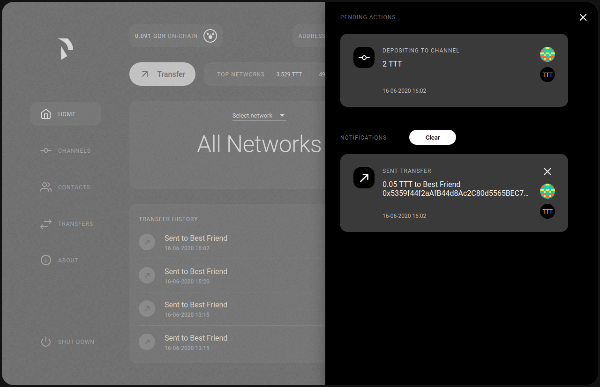

Gatecoin Web Interface Tutorial
#############################

The Gatecoin web interface (WebUI) helps you to interact with your Gatecoin node and aims to inspire to create own applications that utilize the Gatecoin REST API endpoints.

Run the Gatecoin web application
==============================

To run the WebUI you need to install Gatecoin and set up a Gatecoin node.
The easiest way to do so is by using the :doc:`quick start guide <../installation/quick-start/README>`.

**Once you have a Gatecoin node up and running the WebUI will be available
on** `http://localhost:5001 <http://localhost:5001/>`__\ **.**

.. include:: screens.inc.rst

.. include:: user-deposit.inc.rst

.. include:: join-a-token-network.inc.rst

.. include:: payment.inc.rst

.. include:: add-more-tokens.inc.rst

.. include:: close-channels-and-settle-payments.inc.rst
